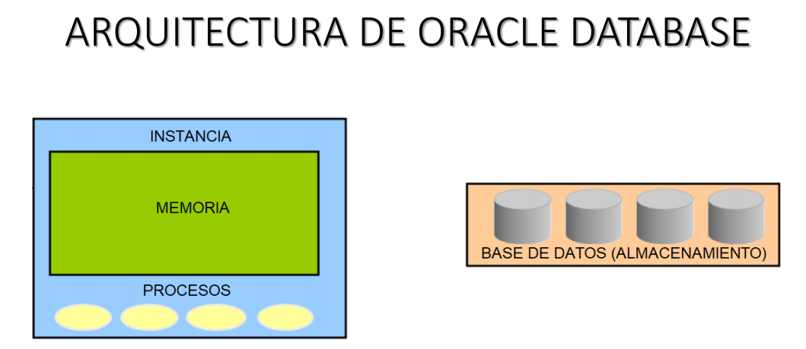
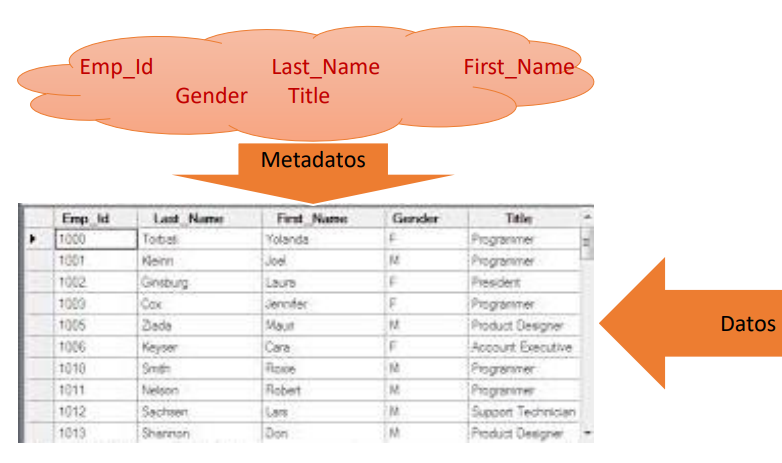
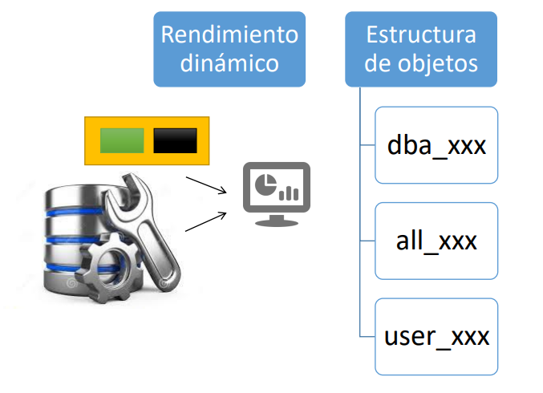
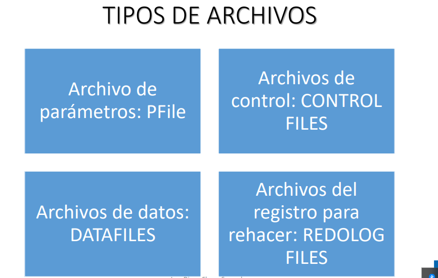
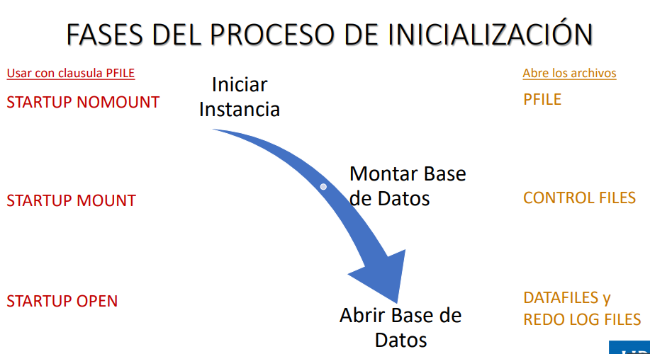
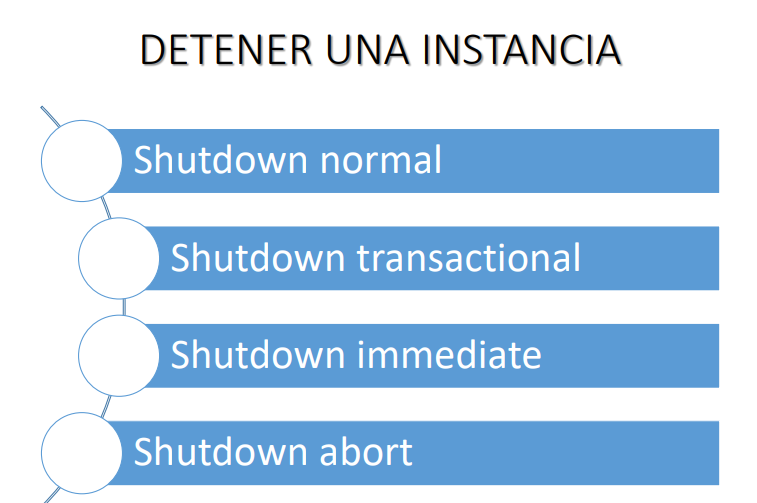
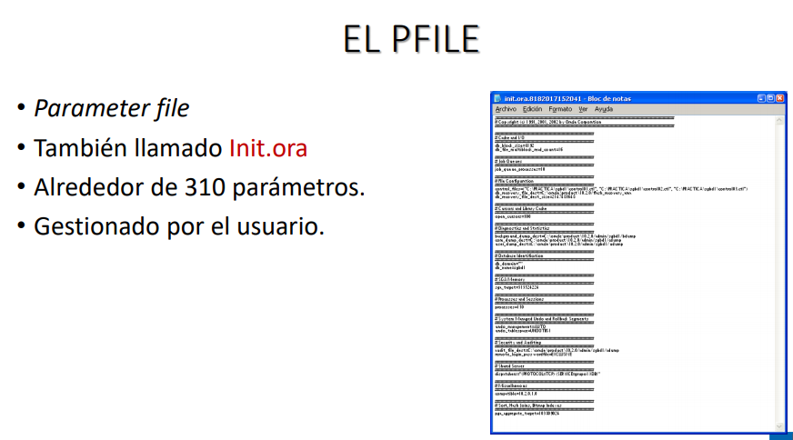
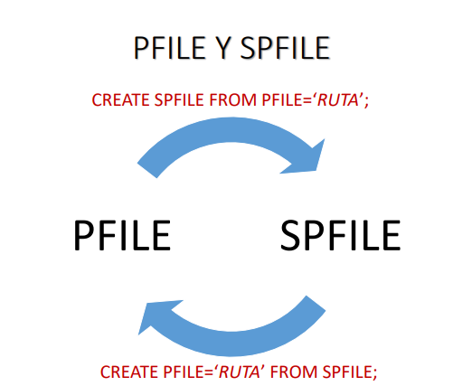

##### ARQUITECTURA DE ORACLE DATABASE

Por lo general cuando decimos Base de datos nos referimos al almacenamiento fisico donde se guarda los datos y cuando hablamos de instancia nos referimos al espacio de memoria  que se reserva al momento cuando iniciamos la base de datos. Se requiere un espacio de memoria por el motivo de que cuando queramos realizar una modificación y tratar los datos, necesitamos recuperarlos del disco, guardalos a memoria, realizar las modificaciones y luego volver a guardarlos y ademas necesitamos que se inicie ciertos procesos.

¿Qué tipos de procesos?

procesos que nos permitiran realizar todas las operaciones para q la BD funcione de forma adecuada. Cuando hablamos de instancia nos referimos de memoria y los procesos que trabajaen en conjunto para que la BD pueda recuperar o almacenar datos en disco.

Para que quede claro hemos creado una base de datos de instancia única, esto quiere decir q por cada BD especifica que tengas se va a iniciar una instancia. ¿Podemos la misma BD inciarla con diferentes estructuras de memoria o instancias?
Sí podemos, porque la instancia justamente lo define, por ejemplo yo reservo 500 megas para una BD, pero puede ser que esa misma BD lo incie con un espacio mayor e inclusive internamente la memoria tiene ciertos contenedores que nos permiten justamente el funcionamiento de la BD, en cuanto a los procesos tambien, porque cuando definimos la estructura de mememoria con la que incia la BD los procesos tambien van a trabajar.

##### EL DICCIONARIO DE DATOS

Cuando nosotros creamos una base de datos la finalidad es almacenar datos y realizar ciertas operaciones, entonces necesitamos tener el espacio en fisico para alamcenar estos datos antes de guardarlos a disco se tiene q almacenar temporalmente en la memoria donde realizamos la modificación y depende de los algoritmos, ciertos procesos que trabajan y luego se guardan en disco. Además también necesitamos grabar la metadata, es decir las deficiones acerca de los datos q vamos a almacenar, por ejemplo podemos tener el id del empleado, el apellido, el nombre, genero, etc. Entonces necesitamos tener estructuras que nos permitan almacenar los datos (001, jair, moreno, masculino) pero también necesitamos estrcturas para alacenar (id, nombre, apellido, sexo).

##### ¿Qué vistas existen para poder acceder al diccionario de datos?

 Aquí hablamos de dos especificos:

- Vista de rendimeinto dinamico: Son aquellos que nos daran información acerca del funcionamiento de la base de datos, entonces todas estas variables también necesitamos almacenarlas, se almacena en las tablas del sistema, ¿a quien le pertenece estas tablas (esta informacion), osea a cual de los esquemas?

Recordemos que tenemos:

- Esquemas del usuario Sys
- Esquemas del usuario system
- Esquemas de ejemplos que agregamos como esquemas de ejemplos.

¿Entonces volviendo a la pregunta, en que esquema se almacena o mejor dicho a que usuario le pertenece este tipo de información?

Le pertenece al dba : administrador de base de datos. 

Entonces tenemos:

- Vistas Rendimiento dinámico: 
Asi como estadisticas, partes de memorias y otros. Entonces cuando hablamos de las vistas vemos el funcionamiento, entonces cuando nosotros queremos saber el nombre de nuestra base de datos, ¿a que tipo de vista estoy accediendo?, en este caso estoy accediendo a la vista de rendimiento dinamico. 

- Vistas Estructura de objetos:

En este caso nos brinda información de los objetos de la base de datos y aquí nosotros lo manejamos con niveles, dependiendo el usuario que accede (el q realice la consulta y el prefijo que se emplee) entonces se nos brinda la información.

Se maneja de la siguiente forma: 

Tenemos `user_xxx`  que quiere decir que la xxx lo vamos a reemplazar por el nombre del objeto, digamos que son tablas por ejemplo, entonces queremos acceder a la informacion de las tablas de la base de datos, entonces para eso usaremos el prefijo user_servicies. Siempre el objeto va a ir en plural, entonces si yo como usuario, cualquier usuario de mi base de datos, quiero acceder a las tablas que me pertenece entonces empleo el prefijo user para realizar la consulta.

Si como usuario accedo con el prefijo `all_xxx`, quiere decir que voy a poder observar las tablas que me pertenecen como los objetos que me pertenecen  a los cuales tengo permiso de acceder, entonces el all_xxx siempre se encuentra por encima o incluye al user.

Entonces el `dba_xxx` es el que tiene el completo control de la base de datos, entonces el dba va a poder acceder a la información que nos de el all y el user.

Entonces cuando usemos el prefijo dba solo debe de ser un usuario que sea adm de base de datos, es decir que cuando cuando nos conectamos empleamos sys_dba, que eso nos indica que el usuario tiene categoria de adm de base de datos.

Cuando nosotros empleamos rendimiento dinamico, queremos acceder a las vistas de rendimiento dinamico, casi siempre empezamos con v$ y luego el termino que viene esta relacionado con la estructura a la cual queremos acceder. 

##### COMANDOS

> sqlplus /nolog
> conn sys/oracle@pro as sysdba

una vista de rendimiento dinamico es:
> v$database

Entonces, ¿cómo se cual es la estructura de una tabla, campOs  o una lista?

> DESCRIBE v$database

Entonces oracle nos muestra la vista de rendimiento y la informacion es de la base de datos, por ejemplo el ID de la base de datos, el nombre. Esta es información de la base de datos. Entonces si en algún momento queremos saber el modo de apertura de la BD ahi esta open mode por ejemplo.

Si queremos saber el nombre de la base de datos:

> select name from v$database;

Esto es con respecto a las vistas de rendimiento, igual si queremos consultar a alguna especifica, podemos ir a la guia de referencia de oracle y ahí nos brinda la información detallada de cada una de las vistas.

También podemos consultar información acerca de la instancia:

> desc v$instance

Si nos damos cuenta en las vistas de rendimiento dinamico va en singular, en cambio en la vista de los objetos va en plural. // desc es igual a describe.

Entonces con ese comando nos muestra los campos que nos brinda alguna informacion de la instancia, como el numero de instancia, nombre, host, version, etc, y por ejemplo tbn esta el estado de la BD.

Esto es con respecto a las vistas de rendimiento dinamico. Entonces cuando veamos que se accede a alguna vista que empieza con v$ ya sabemos que corresponde a la vista de rendimiento dinamico. 

¿Cómo se con que usuario estoy conectado?

> SHOW USER

Ahora como hemos agregado los esquemas de ejemplos. vamos a acceder como ese usuario, como por ejemplo el usuario scott.

Abrimos otro terminal donde nos conectemos como scrott o hr, que son los esquemas de ejemplos que nos proporciona oracle, que son base de datos de ejemplo que también tienen tablas de diferentes objetos.

Entonces nos conectamos con el usuario scott, para ello escribimos:

> SQLPLUS /NOLOG
> conn scott/tiger@pro

NT: conn es lo mismo que connect, luego va el usuario/la contraseña@la base de datos a la cual queremos acceder y no lo colocamos dba porq no es un administrador de base de datos. Scott si tiene una contraseña que es tiger y hr tiene una contraseña llamada hrn, scott fue creado por un empleado de oracle.

ERROR: ORA-28000: the account is locked
nos dice que el usuario esta bloqueado. 

Claro desde la nueva ventana no se puede porque es otro usuario, entonces pasamos a la otra ventana del usuarios sys y escribimos lo siguiente para desbloquearlo:

> alter user scott account unlock;

ya con esto nos aparece usuario modificado (desbloqueado) y ahora si intento conectarme como scott en el otro cmd: `conn scott/tiger@pro`y me pide cambiar contraseña, le ponemos una.

Pero si no nos aparece lo de colocar nueva contraseña, entonces escribimos en la consola SYS:

> alter user scott identified by sistemas;

Cuando nosotros nos conectamos windows detecta que nosotros como usuarios hemos creado la base de datos  nos conectamos al servidor, no nos pide que tenga contraseña, mosotros podemos ingresar directamente, vamos a probarlo.

Para desconectarnos escribimos:  `SQL> diconnect`

Nos volvemos a conectar de otra manera:
> conn / as sysdba

Y como vemos no nos a pedido contraseña, y nos conectamos de manera normal, porque estpa detectando que este usuario a creado la base de datosy nos conectamos de forma directa (de forma remota no permite).

NT: Esto es una vulnerabilidad, en linux no sucede, tengamoslo en cuenta!

Entonces nos podemos conectar con solo indicar q somos adm de base de datos.

Comando para limpiar Pantalla: `SQL> HOST CLS`

Por otro lado con respecto a las instrucciones, se clasifican instrucciones de `SQL` y instrucciones de `PLSQL` y `SQLPLUS`.

Un pequeño ejemplo es cuando indicamos la instrucción de tipo SELECT:

> select name from v$database

Estás instrucciones permite que va directo al servidor, nos conectamos y recuperamos la información, por ejemplo. Este tipo de instruccion viene del lenguaje de `SQL` (lo sabemos porque estamos usando service), todas aquellas que viene de SQL para que sean enviadas al servidor es necesario q coloquemos el ";" , no interesa en cuanta lineas lo escribamos, solo interesa q este el ; porq esto indica que ahí termina la instruccion, entonces se envia y recupera la información. Si no ponemos el ; este jamas llegará al servidor.

Ahora las instrucciones `PLSQL`, son aquellas que nos permiten programar en un servidor base de datos. Este tipo de instrucciones por lo general se trabaja en bloques y estos también requieren que termine en ;

Pero también existe instrucciones que nunca llega de cierta manera al servidor, porque son comandos que solo se trabaja en el entorno de SQLPLUS, como por ejemplo: `describe` o `connect` estas no necesitan ";" no requiere.

> NT: el / accede al backup (repite la ultima consulta).

Seguimso con las estructuras de los objetos: 
Ya nos conectamos con el usuario scott y queremos ahora conectarnos a las tablas:

> SQL> DESCRIBE USER_TABLES

Escribimos describe, a la vista user porque justamente somos un usuario que quiero acceder a mis tablas, a los objetos que me pertence, luego indico el nombre del objeto TABLES, con esto indicamos que queremos ver los campos que tienen dicha vista.

Ahora si queremos acceder al nombre de las tablas tenemos ahí el TABLE NAME que aparece en la lista de la consulta de la vista.

Quiero saber el nombre de las tablas que pertenece al usuario scott.

> SQL> SELECT TABLE_NAME FROM USER_TABLES;

Nos aparecerá que tiene las tablas: dept, emp, bonus, salgrade.

Ahora quiero acceder no solo a las tablas que me pertenecen, si no también a las que tengo permiso de uso, algunos de los usuarios me dio permiso sobre algunos objetos, asi que queremos las tablas.

> SQL> SELECT TABLE_NAME FROM ALL_TABLES;

Y nos aparecerá toda una lista, 103 filas seleccionadas, alrededor de 99 tablas tiene permiso el usuario scott.

Ahora quiero visualizar todas las tablas de toda la base de datos, pero scott no podrá porque no tiene permiso.

> SQL > SELECT TABLE_NAME FROM DBA_TABLES;

Nos dirá que la tabla o vista no existe, pero si lo hacemos desde el cmd de SYS veremos que si aparece ya que el es el adm de la BD. Nos muestra 2783 filas seleccionada, pero esto se hace usando el prefijo DBA.

##### PROCESO DE INICIALIZACIÓN DE UNA INSTANCIA EN ORACLE DATABASE 11G.

Aquí veremos los tipos de archivos que encontramos en una base de datos después que lo creamos.

-El archivo de parametros :PFile

Se guardan todos los parametros de inicialización, es decir aquellos que nos van a permitir iniciar instancia, por ejemplo: tamaños de los contenedores, parametros relacionados con algunos procesos.  

¿Pero donde los encontramos?
En mi caso es en la siguiente dirección: `C:\app\Sistemas\admin\sgbd\pfile`

Haremos lo siguiente:

Por cada base de datos que creemos se creara una carpeta y dentro de ella hay un Pfile, y ahi tenemos un archivo de parametro, copiamos el archivo y abrimos la copia. Esa copia lo abrimos con el bloc de notas y encontramos algunos parametros que nos indica el tamaño del bloque `db_block_size=8192`.
El nombre de la base de datos: `db_name=sgbd`
También la cantidad de procesos que se van a iniciar: `processes=150`

También nos muestra la ubicación de otros archivos: control_files=("C:\app\Sistemas\oradata\sgbd\control01.ctl", "C:\app\Sistemas\flash_recovery_area\sgbd\control02.ctl")
db_recovery_file_dest=C:\app\Sistemas\flash_recovery_area
db_recovery_file_dest_size=4039114752

Cuando abrimos un archivo con el bloc de notas el problema puede surgir que lo guardamos, lo guarda con otra extensión, primero hay que activar para que se vea la extensión de los archivos. Si se guarda como bloc de notas jamas iniciara la instancia simpllemenete por la extension.

También tenemos el archivo de control: es un archivo q crea oracle donde nso brinda informacion de la BD, como el nombre de la BD, nos indica la version, es como el dni de nuestra base de datos, de tal manera entre otras caracteristicas guarda la ubicacion de los datafiles y los redologfiles. Pero solo la ubicación, estos archivos son serviran para abrir nuestra base de datos.

En otra carpeta encontramos los archivos de control, llevan por nombre contrl01, solo tenemos un solo archivo de control.
También tenemos los datafiles, que son archivos de datos, la informacion de cada una de las tablas. 

También tenemos tenemos los redofiles, que son los archivos donde se guarda los cambios que se da en la base de datos.
Entonces cada vez que realizamos una operacion sobre los datos se guarda ahi, como una modificación, puede ser agregar o eliminar.

##### Fases del proceso de inicialización

¿Ahora como hacemos para iniciar la base de datos?
Hemos creado, conectado y consultado, pero en realidad cuando se inicia se da las estas fases:

Primero se `inicia` la instancia (reservamos el espacio de memoria y creamos los contenedores que requiere oracle y también levantamos ciertos procesos), entonces cuando iniciamos se abre el archivo PFILE, una vez que se ha iniciado la instancia luego pasa a otra fase que es`Montar` la base de datos. Cuando se monta la BD quiere decir que, en el PFILE esta la ruta de los control files,  y se lee el archivo, el nombre, la version y que dafafiles tiene. Una vez que se a montado recién se `abre` la base de datos. En los archivos de control también se encuentra la ubicacion de los datafiles y los reloadfiles que tiene asociada la base de datos y ya cuando pasa a abrir la base de datos abre los datafiles y los redo log files y los bloquea para que ya otro usuario no lo pueda usar.
Entonces sería:

> Iniciar Instancia -> Monstar BD ->Abrir BD

Para pasar de una instancia a otra podemos usar la clausula `startup nomount` 
startup : directamente va a iniciar la fase hasta donde nosotros lo indiquemos. Si solo queremos iniciar la instancia le damos escribimos startup nomount y lo podemos indicar el pfile. 

¿Se puede modificar el pfile? 
claro que si, pero con mucho cuidado.

También puedo iniciar la base de datos, entonces le damos startup mount y tambien directamente decirle a oracle que abra la base de datos, pero cuando abre la BD quiere decir que la inicia, la monta y lo abre, entonces para ello le damos `startupOpen`.

Hemos cambiado el nombre de uno de pfile, ya que habiamos hecho una copia, pero antes al original le cambiamos la extension, pues borramos todos los números y guardamos.

Ahora vamos a iniciar la base de datos con ese archivo:
pero primero lo apagaremos con:

> SQL > SHUTDOWN IMMEDIATE

Con este comando nos dice que se a cerrado, se a desmontado y se a cerrado, a paso por todas las etapas.

Ahora vamos a iniciar la BD pero en este caso la abriremos directamente:

> STARTUP OPEN PFILE='C:\app\Sistemas\admin\sgbd\pfile\INIT.ORA'

NT: La ruta del pfile entre comillas simples, copiamos la ruta y agregamos al final el nombre del archivo.

Con ese comando le decimos que abra, va a tener que pasar por inicio luego meterse a la base de datos y finalmente abrirla, cuando se abre ya podemos consultar la base de datos. Luego no aparecerá como se inicia la instancia, se monta y lo abre. Si ocurre algún error oracle nos lo informa.

Pero podemos solucionar el error, nos dice en que parte está, porque tiene que ver con los archivos de control no se va a montar, si tiene que ver con los datafiles o lo reloadfiles no se va abrir la base de datos.

Ahora lo apagaremos y lo iniciaremos por partes:

> SQL> SHUTDOWN IMMEDIATE

Cuando queremos iniciar la base de datos el startup solo se una una vez (mirar imagen de los comandos).

Si queremos iniciar la base de datos escribimos:

> STARTUP NOMOUNT PFILE='..'

Pero ya luego no podremos usar startup mount para montarla, asi que escribiremos los otros comandos como alter database mount; y después alter database open;

Primero paso la instancia, la monto y luego lo abrió, tiene que salirte base de datos modificada!
Cuando se abre la BD recién puedo realizar las consultas, recién puedo recuperar la data, realizar interacciones, actualizaciones, etc.

Con esto ya sabemos de que manera podemos pasar de una fase a otra!

##### Como detener una Instancia

Asi como iniciamos por fases, cuando lo detenemos no lo hacemos por fases, osea no nos detenemos, si no que se apaga directamente, entonces tenemos las sgts opciones: 

- Shutdown Normal : cada shutdown tiene que ver con conexiones y transiciones, este shutdown quiere decir que no permite a mas usuarios que se conecten, pero los que ya están conectados lo siguen estando. Pero se espera que esa transacciones que estaban trabajando en ese momento se finalizen, y los usuarios pueden iniciar nuevas transacciones, lo que si no pueden es nuevos usuarios conectarse a la base de datos. Entonces espera que todos los usuarios se desconecten para apagar la BD, por lo que demanda mucho tiempo.

- Shutdown Transactional : en el momento que mandamos el shutdown todos los usuarios seguiran trabajando, pero no se pueden conectar nuevos usuarios y las transacciones que se estaban trabajando en el momento solo se espera que finalice y ya no se puede iniciar nuevas, y recién se apaga la base de datos.

- Shutdown Inmmediate: no se permite nuevas conexiones y las transacciones que se estaban trabajando en ese momento se cortan, cuando se cortan la transaccion se corta la base de datos queda en un estado inconsistente. se realiza un rockbal, esto quiere decir que se deshace esas transacciones, de modo que se llega la BD a un estado consistente y se cierra la BD.

- Shutdown abort: este shutdown no se usa, solo se usa en el caso que sea muy muy necesario, se usa cuando los demas shutdown no ha funcionado y la base de datos no permite cerrar (por algún problema), entonces en este caso cuando enviamos un shutdown abort, oracle hace es cortar las transacciones que se trabajan en ese momento y lo cierra de forma brusca, de tal manera que cuando lo iniciemos nuevamente tendremos que iniciar algún tipo de recuperación para volver a que esté en un estado consistente.

##### Estados de una Base de Datos

He aquí los mas comunes:

- Read Only: un estado de solo lectura, es decir solo podremos leer los datos, no podremos escirbir.¿Y de q manera podremos llevar la BD a un estado read only? 
Simplemente abrimos la base de datos y escribimos `alter database open read only`, de esa forma podremos abrirlo como solo lectura. También podemos cambiar a modo escritura.

> ALTER DATABASE READ ONLY;

> ALTER DATABASE READ WRITE;

- Restrict: En este modo por ejem cuando realizamos operaciones de carga de datos, en este trazo tenemos que llevar la base de datos a un estado que solamente los usuarios que puedan realizar esas operaciones (por lo general son administrativos) otros usuarios no, en ese caso hablamos de que nuestra base de datos en modo restringido.

Para activar este modo directamente con startup, tambien tenemos un archivo que dice estados DB.
Podemos iniciarlo restringido:

> STARTUP RESTRICT PFILE=...

Con esto lo desactivamos:

> ALTER SYSTEM DISABLE RESTRICTED SESSION;

Activamos:

> ALTER SYSTEM ENABLE RESTRICTED SESSION;

- Quiesce: este modo se emplea cuando por ejemplo, que solamente adm de base de dtos se conecten a la base de datos de tal manera que para cambiar a un estado quiesce solo le damos:

> ALTER SYSTEM QUIESCE RESTRICTED;

Cuando queremos salir de este modo:

> ALTER SYSTEM UNQUIESCE;

- Suspend: lo usamos en los casos cuando queremos algunas copias ,backups, entonces suspendemos la base de datos y lo mandamos al estado con:

> ALTER SYSTEM SUSPEND;

Para salir  de este estado:

> ALTER SYSTEM RESUME;

##### Parámetros de Inicialización

En el PFILE existen alrededor de 310 parametros, en la version 10 eran algo de 200 y picos, esto nos permite iniciar instancias pero para gente gestionada por el usuario, el usuario es el encargado de definir de que manera quiere estructurar la memoria y que procesos quiere que se inicie.

##### Tipos de Parámetros

- Básicos: aquellos que encontramos en el pfile, ejem controlfile.

- Parámetros no modificables: no podemos cambiar, como por ejemplo el tamaño del bloque que es una unidad fundamental que define la unidad minima para almacenar los datos.

- Dinamicos: son en los cuales podemos modificar el valor cuando la instancia a sido iniciada, es decir mientras la instancia esta trabajando en ese momento podemos cambiarlo, pero cuando no inciamos la base de datos se pierde ese valor, entonces si queremos mantener el valor de ese parámetro tendremos que escribirlo en el propio PFILE.

También existen otros que están definidos por defecto

¿De que manera podemos cambiar el valor de un parametro? 

> ALTER SYSTEM SET NOMBREPARAMETRO=VALOR SCOPE=[MEMORY,SPFILE O BOTH];

Y podemos definir el alcance, es decir ese alcance hasta que momento se va a dar. Puedo indicar memory, que quiere decir que el cambio se dará en memoria, es decir mientras que apago y inicio la BD ese valor no se encuentra, regresa a su valor inicial. También tenemos el SPFILE. Existen un servidor de parametros que es gestioando por oracle, y ahi se modifican los parámetros de inicialización.

Cuando se hace permamnente los cambios dinámicos, es decir cuando realizamos un cambio de un parametro y lo definimos, y lo colocamos como alcance en PFILE, quiere decir que ese cambio también estará disponible incluso cuando se apaga y se vuelva a iniciar la base de datos.

Otro de los alcances es BOTH que quiere decir que cuando indicamos el cambio en el parámetro en el momento cuando esta iniciada y también cuando se reinicie la base de datos, osea en ambos, por defecto si no colocamos el scope el alcance es Both, y esto también dependera de como iniciamos la base de datos, porque cuando iniciamos podemos indicar si quiere leyendo el PFILE o el SPFILE, entonces si nosotros iniciamos leyendo el el PFILE todos los cambios que se den se van a mentener mientras la BD se encuentre abierta en ese instante y si queremos hacer un cambio en un parametro permanente pues tendriamos que escribirlo directamente en el PFILE. Sin embargo en el SPFILE todo se escribe directamente en el servidor de parámetros.

##### El SPFILE

Apagamos la base de datos y luego la iniciamos `STARTUP OPEN PFILE='larutadelpfile/INIT.ORA'`

¿Para que hacemos esto?

Porque queremos que se inicie la instancia de PFILE, existe dos maneras de gestionar los parámetros, ya se de forma manual que es con el pfile y de forma automatica es con servidor de parámetros que se denomina SPFILE.

Abrimos la base de datos y ahora intentaremos modificar un parámetro, pero primero veremos los parametros, por ejemplo las sesiones (es decir cuantos usuarios se puede conectar, cuantas sesiones se pueden iniciar en la BD):

> SQL> SHOW PARAMETER SESSIONS

Intentaremos modificar el valor de sessions, para eso escribimos:

> ALTER SYSTEM SET SESSIONS=100;

Nos indica que no se peude modificar porque es un parámetro no modificable.
Entonces intentaremos con otro:

> SQL> SHOW PARAMETER JOB_QUEUE_PROCESSES

(Nos indica el número de procesos que trabajan de forma paralela para programar una tareas.)

Después nos aparecerá su valor (1000)

Modificamos:

> SQL> ALTER SYSTEM SET_QUEUE_PROCESSES=100;

Nos sale sistema modificado, eso quiere decir que es un parámetro dinamico.

Pero, ¿Qué sucede cuando reiniciamos la base de datos leyendo PFILE? 
El valor del parámetro va a cambiar, va a regresar al valor original, para eso apagamos la base de datos nuevamente y la iniciamos (LEYENDO EL PFILE) para verificar.

> SQL> SHOW PARAMETER JOB_QUEUE_PROCESSES

Y nos aparece su valor por defecto, no se guardó, asi que si queremos hace permanente ese cambio, tenemos que escribir directamente en el PFILE, de esa manera se guarda, pero por otro lado también podemos hacerlo de otra manera, ahora mismo la gestión es manual porque iniciamos con el PFILE, porque nosotros indicamos si queremos modificar y damos el valor directamente (PFILE es un archivo de texto plano, podemos verlo y modificarlo), sin embargo existe otra manera de gestionarlo a traves del SPFILE. El SPFILE viene a ser el servidor de parámetros, es gestionado desde el lado del servidor, este es un archivo binarios, no se puede modificar directamente, entonces en ese caso lo que podemos hacer es para conservar los cambios en el parámetro, pues lo escribimos en el pfile o iniciamos la instancia leyendo ese pfile. Para saber si la BD ha iniciado con SPFILE O PFILE, escribimos:

> SQL> SHOW PARAMETER SPFILE

Quiere decir que no hemos inciado la instancia leyendo SPFILE, si no con PFILE.

Cerramos e iniciamos con SPFILE:

> SQL> STARTUP OPEN 

Sin colocar el SPFILE, entonces esta inicia, la monta y la abre y ahora consultamos:

> SQL> SHOW PARAMETER SPFILE

Y nos indica la ubicación del SPFILE (se encuentra en: `DBHOME/DATABASE/SPFILESGBD.HORA`)

Ahora queremos que un cambio en ese parametro `QUEUE_PROCESSES` se mantenga, para esto primero consultamos:

> SQL> SHOW PARAMETER JOB_QUEUE_PROCESSES (si valor es de 1000)

Y ahora lo modificamos:

> SQL> ALTER SYSTEM SET JOB_QUEUE_PROCESSES=100 SCOPE

Queremos  darle un alcance, el SCOPE, es decir ese cambio hasta donde quieres que llegue, solamente que se quede en memoria o que sea permanente?
Entonces con scope podemos indicarlo lo que queremos. Si nosotros no colocamos el scope, es booth por defecto, solo cuando se a iniciado con spfile.

Escribimos: 

> SQL> ALTER SYSTEM SET JOB_QUEUE_PROCESSES=100 SCOPE=SPFILE;

CONSULTAMOS:

> SQL> SHOW PARAMETER JOB_QUEUE_PROCESSES

Pero nos aparece el mismo valor, porque el cambio solo estará disponible cuando reiniciemos la BD porque asi lo indicamos en SCOPE=FILE;

Ya hemos escrito el nuevo valor, pero como nosotros inciamos la BD con el SPFILE con ciertos valores, no se hace en ese preciso momento.
Entonces queremos que demuestre el cambio, para eso apagamos la base de datos, y nuevamente inciamos leyendo el SPFILE.

> SQL> STARTUP

Ahora consultamos el parámetro:

> SQL> SHOW PARAMETER JOB_QUEUE_PROCESSES

Nos aparece el nuevo valor.

Por otro lado, si inciamos con PFILE, nosotros podemos crear un SPFILE apartir de ese PFILE, podemos hacer justamente estos cambios, es decir apartir de un pfile crear un spfile, es decir chancar y tomar sus valores o puedo hacer lo contrario, apartir de spfile podemos crear un pfile (cualquiera de las dos maneras se puede), para hacer esto escribimos:

`CREATE SPFILE FROM PFILE='RUTA';` 
Aquí le indicamos, tienes que crear un SPFILE apartir de un PFILE que esta trabajando en ese momento.

`CREATE PFILE='RUTA' FROM SPFILE;`  // aqui indicamos que vamos a crear un pfile, indicamos la ruta, apartir del spfile que esta siendo utilizado en ese momento por la base de datos.

Por ejemplo:

Como ya hemos iniciado con SPFILE, vamos a crear un PFILE apartir de ese SPFILE:
indicamos: quiero que se cree un PFILE, al PFILE es el unico que se  le indica la ruta porque ya tiene uno por defecto. 

> SQL> CREATE PFILE='C:\INITNUEVO_SPFILE.ORA'FROM SPFILE;

> CREATE SPFILE='C:\INITNUEVO_PFILE.ORA' FROM

Nos aparecerá archivo creado.

Ese archivo podremos usarlo cuando iniciamos la base de datos justamente leyendo el PFILE, entonces recién podremos crear un SPFILE.

Cuando iniciemos la base de datos siempre será leyendo este servidor de parámetros, a menos que se nos indique el hacerlo con PFILE, con el otro es mejor, mas adecuada y sencilla, en el curso será por defecto.

