### Distribución de la Memoria

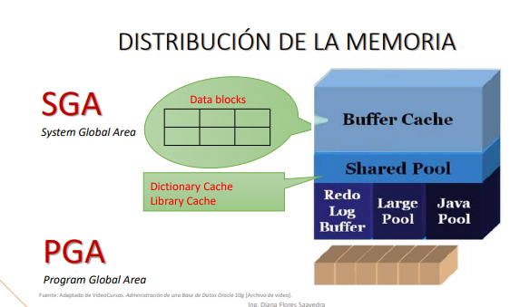

Cuando hablamos de una instancia reservamos un espacio de memoria donde se crea diferentes comtenedores. 

¿Cómo se distribuye la memoria a tipo data?
Cuando iniciamos una instancia en memoria, digamos que son 500 se van a crear diversas estructuras, principalmente identificamos dos grandes areas. 
SGA (System Global Areas) y PGA (Program Global Area), PGA va creciendo a medida que los usuarios se conecten.

Dentro de `SGA` identificamos los contenedores:

- Buffer Cache
- Shared Pool
- Redo  Log Buffer
- Redo Log Buffer
- Large Pool
- Java Pool

- Buffer Cache: Aqui se carga los datos que vamos a leer del disco.
Cada vez que iniciamos se crean todas las estructuras mencionadas en memoria. El Buffer cache lee los datos y se carga en memoria, justo en el Buffer Cache vamos a tener los bloques de datos.

Buffer Cache: Aqui se carga lso datos que vamos a leer del disco.
Cada evz que iniciamos se crean todas las estructuras mencionadas en memoria. El Buffer cache lee los datos y se carga en memoria,justo en el BC vamos a tener los bloques de datos.

La gestion es de la siguiente manera, el Buffer Cache emplea el algoritmo LRU que quiere decir: el menos usado recientemente. Cada vez que cargamos los datos del disco aquí y nosotros modificamos la información de uno de los bloques, y este valor modificado se coloca en los extremos de la lista. En un tiempo x en cada extremo tendremos los bloques mas usados (en las que hacemos cambios ) y en el otro lado
los bloques menos usados. Entonces cuando el Buffer Cache necesita más espacio, la limpieza será por el lado de los bloques menos usados.

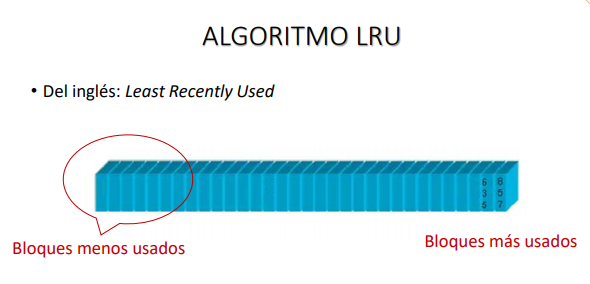

- Shared Pool: Es un contenedor compartido, contiene información que va ser igual para todos, que se conecten justamente a la BD. Justo aquí tenemos:

. Dictionary Cache: es el diccionario de datos.

. Library Cache: los planes de ejecución, por ejemplo una consulta (ese plan se carga aquí).

También tenemos el:

- Redo Log Buffer: todos los cambios que realizamos en los datos o información que se encuentra en la Buffer Cache, ese cambio se escribe aquí, en el redo log Buffer.

- Large Pool: es un contenedor opcional, es decir se puede crear como que no y es usado justamente para el sistema para realizar las copias de seguridad, entonces podemos hacer uso de este contenedor.

- Java Pool: También puede considerarse opcional, aquí es donde se carga las instrucciones o variables que son propias del código de java.

Oracle justamente necesita la maquina virtual de java para trabajar. Entonces todo esto viene a ser la estructura de la memoria, de la SGA. El tamaño de cada uno de estos contenedores (BC,SP,RLB,LP,JP) se definen como parámetros y se encuentran en el SPFILE O PFILE, ahi es donde se guarda estos tamaños, de tal manera que cuando iniciamos la instancia es cuando lee estos archivos y reservas los espacios necesarios.

En cuanto a `PGA`, aquí es donde cada usuarios que se conecta a la base de datos se genera un cierto espacio donde se guarda las variables e  instrucciones propias de la sesión. De tal manera que la PGA va creciendo a medida que mas usuarios se conectan.

### Gestión Manual

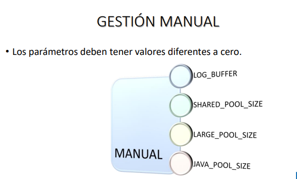

Para gestionar la memoria podemos realizarlo de 2 formas manual o automatica, en la manual quiere decir que tenemos definir el valor de cada uno de los contenedores, claro que oracle nos puede sugerir los tamaños, pero igual es en cierta forma tediosa, entonces si queremos realizar una gestion manual, los parámetros que justamente que definen el tamaño de dichos contenedores del SGA son:

- LOG_BUFFER
- SHARED_POOL_SIZE
- LARGE_POOL_SIZE
- JAVA_POOL_SIZE

El valor de estos parámetros están en 0 sobre todo los que terminan en size_ cuando esta en cero quiere decir que la gestión no es manual, cuando es manual tiene q ser mayor a 0.

### Gestión Automática

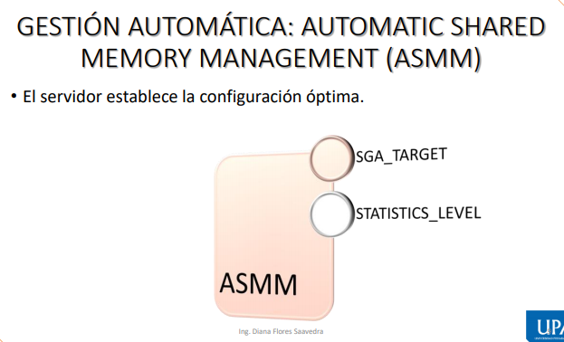

Para la gestión automatica se puede realizar a través de la ASMM (Gestión de memoria automatica ), en toda gestión automatica quien se encarga de adminsitrar o definir el tamaño de los contenedores es el servidor, en base a estadistica del uso que le estamos dando al servidor (base de datos), para poder activar la gestión a través de la ASMM el parametro es: `SGA_TARGET`, si este valor es mayor a 0 entonces quiere decir que esta funcionando el componente. Si el valor es 0 entonces quiere decir que no se esta encargando de gestionar la memoria. 

`STATISTICS_LEVEL` es el parametro que define si las estadisticas estan activadas o no.

Para consultar si está trabajando el SGA:

> SQL> SHOW PARAMETER SGA_TARGET

### Los Procesos

Se dividen en 2, procesos servidor y procesos background.

- Procesos servidor o procesos de usuario, es cuando nosotros solicitamos que se ejecute de cierta forma, por ejemplo, cuando nosotros buscamos los datos en los data files y se carga en el buffer cache. Por otro lado cada vez que un bloque en el buffer cache es modificado este cambio que se realizó se escribe en el redo log buffer. 

- Procesos Background: Son procesos de segundo plano, aquellos que no llamamos para que se ejecuten.

Los tipos de procesos principales son: `DBWR`, `CHKPT`, `LGWR`.

- DBWR: se encarga de escribir los cambios que se han dado en el buffer cache y se encarga de escribirlo en los data files. 

- LGWR: cada cambio o cada Redo log buffer se guarda en el redo log files. El redo log file es el que guarda el archivo historico de los cambios de nuestra base de datos, en este caso el DBWR si es el único proceso. 

- CHKPT: es el encargado de sincronizar lo que se tiene en memoria con el disco. Se va a lanzar cada periodo de tiempo, puede ser cada 3 segundos y en el momento que se lanza se encarga de decir lo sgt: DBWR hasta tu trabajo, LGWR también has tu trabajo. El número de cambios se guarda en el archivo de control.

### Archivos de Control

Estos se encuentran en oradata. En este archivo es como si fuera el DNI, encontramos el nombre de la BD, la fecha de creacion, numero de cambios que se dan en la base de datos, el ultimo checkpoint que se ha dado a la base de datos y también la ubicación de los data files y redo log files (esta ubicación de guarda porque cuando se monta la base de datos lo que hace el sistema es leer estos archivos para saber en q punto se ha quedado, de tal manera que cuando lo volvemos a abrir podemos trabajar de manera normal).

##### Tareas de Gestión

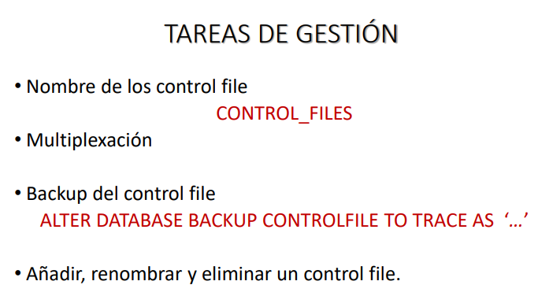

Son las tareas que podemos realizar sobre esos archivos

- Nombre de control file: 

 > CONTROL_FILES

Aquí nos indican la ubicación, una base de datos puede tener varios archivos de control, pero minimo debe tener 1.

- Multiplexación: quiere decir realizar tantas copias de los archivos como deseamos. Si yo tengo un archivo de control y deseo multiplexarlo, hacemos la copia e indicamos en el sistema que tenemos dos.

- Backup del control file:

>ALTER DATABASE BACKUP CONTROLFILE TO TRACE AS '....' 
// realizamos un rastreo de todos los cambios de la base de datos y en este archivo se guardan los comandos.

- Añadir, renombrar y eliminar un control file:

En este caso tiene que ver con la multiplexación.
En el archivo de control se guarda los cambios en la estructura de la base de datos, por ejemplo creamos un archivo nuevo, un tablaspace u otro cambio que implique una modificación estructural en la base de datos.

### Vistas del Diccionario para el control file

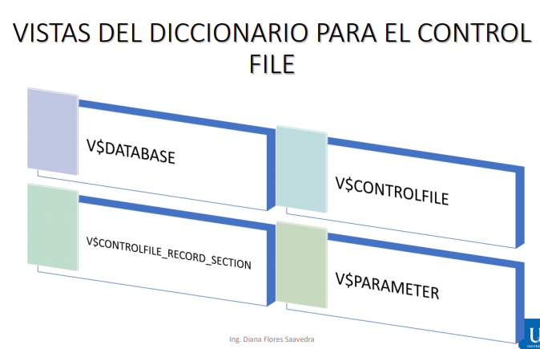

> V$DATABASE  // Me brinda información de la base de datos.

> V$CONTROLFILE  // Me muestra la ubicacuon de los archivos de control e incluisve muestra mas información.

> V$CONTROLFILE_RECORD_SECTION  // nos brinda información de como esta distribuido nuestro archivo de control.

> V$PARAMETER // consultar los parametros que tiene la base de datos.

##### Consultar los archivos de Control

> SQL> SHOW PARAMETER CONTROL_FILES

Me indica las ubcaciones y también hay otro, tenemos dos ubicaciones, los copiamos las ubicaciones y en un block los copiamos porque luego se necesita las ubicaciones.

IMPORTANTE: Los archivos de control se Manipula solo estando apagado la base de datos!

Ahora solo indicaremos que solo lea un archivo de control, tenemos que iniciar como sys, porque los cambios tiene que hacerlo un adm.

Multiplexando: 

> SQL> ALTER SYSTEM SET CONTROL_FILES='C:\APP\SISTEMAS\ORADATA\SGBD\CONTROL01.CTL' , 'C:\APP\SISTEMAS\ORADATA\SGBD\CONTROL01.CTL'

IMPORTANTE: Tiene que ir en comillas simples y separado por comas, eso es para un solo archivo de control, la ruta tiene que estar bien estructurada, porque si escribimos mal no va a montar la base de datos.

Creamos un disco, en este caso lo simulamos como una carpeta (fuera de la carpeta app), abrimos nuevamnete la comilla e indicamos el nombre del archivo: escribimos el nombre que queremos, bueno como ya pusimos el control1 y 02, entonces le ponemos el control 03. una vez terminado le damos el espacio SCOPE=SPFILE;
Ají le indicamos que tiene que multiplexar un archivo de control, le decimos que vamos a tener 3, los archivos tienen que estar ubicados en diferentes lugares.

Una vez que ese cambio estará disponible para el siguiente inicio de la base de datos, lo apagamos.

> SQL> SHUTDOWN IMMEDIATE

Tenemos que esperar que termine para recién realizar la copia, vamos a la unidad y buscamos un archivo de control, lo copiamos y lo pegamos en la carpeta que habiamos creado (es el mismo archivo, solo cambiamos el nombre 03) y nos seccioramos que tenemos los nombres visibles en el Sistema operativo. 
Lo que hicimos fue lo mismo que el host copy, si no q de forma grafica.

Entonces una vez copiada entonces recién iniciamos la BD:

> SQL> STARTUP

Para iniciar el listener ya que nos aparece que no se a podido transferir la conexión.

Vamos a ejecutar y escribimos : `SERVICES.MSC`

Buscamos oracle home listener y le damos a iniciar, pero sin aún asi nos aparece: manejador de servicio no inicializado, error interno, No existe la extension hostdef. Hacemos la vieja confiable, cerramos el terminal y volvemos a abrirlo.

Volvemos a conectarnos como SYS. // tbn iniciamos oracleservicesgbd y el liestener.

consultamos: 

> SQL> SHOW PARAMETER CONTROL_FILES

Si nos damos cuenta ya aparecen los tres, de tal manera que ya esta multiplexado. Eso fue en cuanto a los archivos de control.

### Los Redo Log Files Online

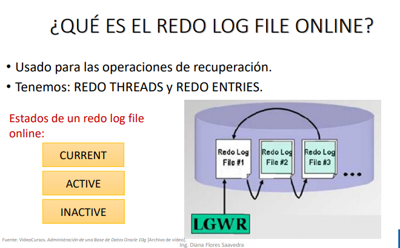

Estos archivos son los que nos van ayudar para manejar operaciones en la BD, todos los cambios que realizamos estan escritos en estos archivos, al hablar de cambios son cambios pero en los datos. 

Tenemos dos tipos de entradas:

- REDO THREADS: Nos indica el numero de instancias que comparten los redo file online. Nosotros en nuestra BD indicamos que seria de instancia unica, no elegimos la otra opcion que era clase y este se maneja justamente con clases.

- REDO ENTRIES: Son los cambios q se van a dar en la bd (update, delete, etc). En una base de datos podemos de tener como minimo 2 archivos redos log. cuando creamos una BD tenemos 3 archivos redo lof file. Una vez que se llena el primer redo se da un log switch, es un salto de un redo a otro archivo redo, se da el salto y se pasa al otro redo. Nuevamente cuando se llena el segundo se da un salto y nuevamente en el 3er archivo comienza a escribir hasta que se llene, entonces cuando se llena estos archivos, entonces el 3ro se va al primero, de tal manera que lo que tenia en el primer archivo se borra y se comienza a escribir de nuevo, de tal manera que estos redo log file online, aqui se guardan  solo algunos cambios de la BD, hablamos de los online.

Un archivo redo puede tener 3 estados:

- CURRENT: quiere decir que ese archivo redo esta siendo escrito por el LGWR, quiere decir que se esta apuntando justamente a ese redo.

- ACTIVE: que un redo contiene informacion que va a servir para la recuperacion de la base de datos.

- INACTIVE:  ejemplo, cuando recien iniciamos en el redo 1 y los otros estan vacios, no contienen informacion.

### Multiplexación del Redo Log File Online

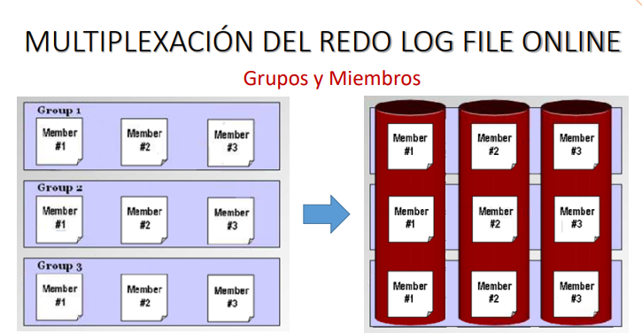

Aquí también podemos hacer una multiplexación de los redos, podemos tener tantos redos distribuidos en diferentes discos, por tal motivo por si pasa algo en un disco pues tengo otro de los cuales voy a obtener la informacion.

Está log switch que se da de un salto a otro, se da de un redo a otro, se da por grupos. 
Minimo un grupo debe de tener un redo y cada archivo que esta en el grupo se le denomina `Member`, 

¿Y que información tienen los varios redos de un grupo?

Tienen la misma, entonces viene el LGWR y dice sabes que tengo que escribir en el primer bloque y esa misma se escribe en las demas. 

Cuando ya tenemos lleno lo del primer grupo, pasamos al segundo grupo (se da el log switch). hay que recalcar que los 3 mismo tienen la misma informacion, se llena el segundo grupo y va al tercer grupo, y si se llena el tercero pues apunta a nuevamente a los primeros,

¿ Por qué se trabaja de esta forma? ,¿Tener varios archivos con la misma informacion?

Porque la idea es tener en diferentes discos la misma información de recuperación.

¿Como puedo saber cuantos grupos tengo y cuandos miembros?

> SQL> DESCRIBE V$LOG

Nos muestra el numero de grupo y el numero de miembros, entonces consultamos los campos:

> SQL> SELECT GROUP#, MEMBERS FROM V$LOG;

También hay otra vista:

> SQL> DESCRIBE V$LOGFILE

Aquí nos muestra el número del grupo y el miembro, pero nos muestra de otro tipo, inclusive nos muestra el status.

> SQL> SELECT GROUP#, MEMBERS, STATUS FROM V$LOG;

Aquí nos muestra que actualmente hay 3 grupos y que está escribiendo en el grupo 3, es lo que muestra la bd de la profesora, nos aparecerá diferente a nosotros.

Ahora consultamos la ubicación de cada Redo:

> SQL> SELECT GROUP#, MEMBER FROM V$LOGFILE;

Nos muestra la cantidad de nuestros redos, pero a la profesora le aparece un archivo en cada bloque, no hay multiplexacion. 

### Contadores

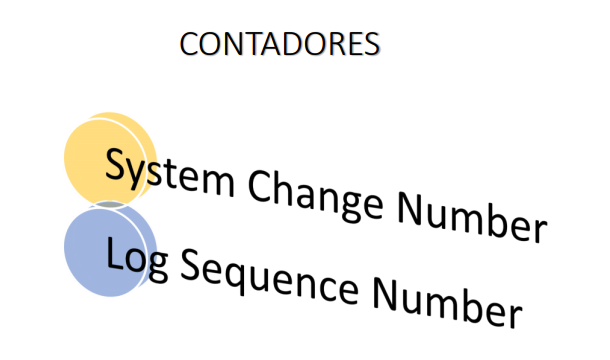

Existe  2 contadores importantes:

- System change Number: contador de los cambios que se están realizando en la base de datos, contador de redos sobre los cuales se escribe.

- Log Sequence Number: el contador de los saltos. Entonces cada vez que escribimos en un redo log online, si ya esta lleno se cambia a otro entonces el contador cambia.

##### Tareas de Gestión sobre los redos

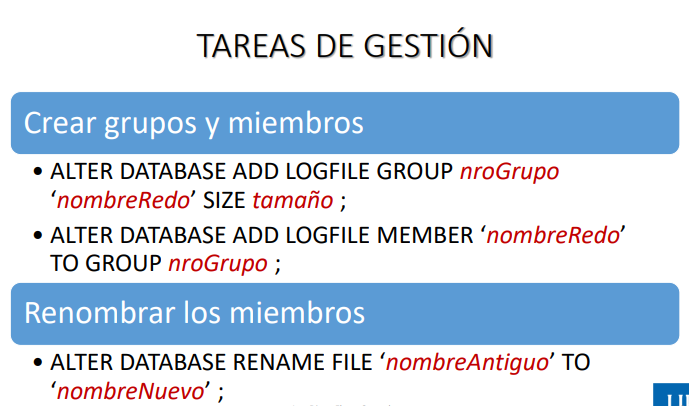

- Para crear los grupos y miembros: 

> LTER DATABASE ADD LOGFILE GROUP nroGrupo 'nombreRedo (ruta, nombre del archivo redo.extension osea .log)' SIZE tamaño; (tamaño que tendrá cada miembros de dicho grupo)

- Para agregar: 

> ALTER DATABASE ADD LOGFILE MEMBER 'nombreRedo' TO GROUP nroGroup;

- Como cambiar o renombrar el nombre de un miembro:

> ALTER DATABASE RENAME FILE 'nombreAntiguo' TO 'nombreNuevo';

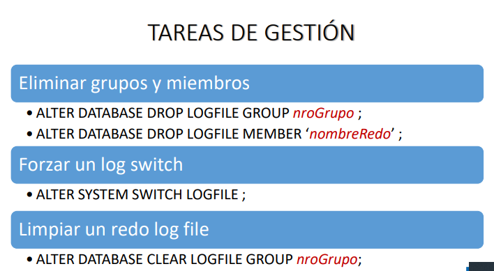

- Eliminar grupos y miembros.

> ALTER DATABASE DROP LOGFILE GROUP nroGroup;

> ALTER DATABASE DROP LOGFILE MEMBER 'nombreRedo'; //ruta, nombre.extension

- Forzar un log switch  //realizar un salto de un grupo a otro

> ALTER SYSTEM SWITCH LOGFILE; //lo forzamos

- Limpiar un redo log file

> ALTER DATABASE CLEAR LOGFILE GROUP nroGrupo; 

Si el sistema no puede escribir en un cierto redo, entonces la base de datos no permite realizar cambios y se queda parada, en estos casos solo nos queda limpiar los redos, perdemos los ultimos cambios y es mejor a que se quede la BD parada.

### Vistas del Diccionario y comandos para el Redo Log File Online

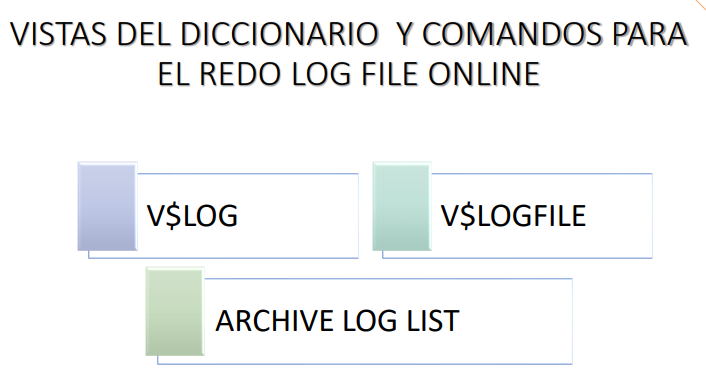

> V$LOG : ya lo vimos.

> V$LOGFILE : ya lo vimos.

> ARCHIVE LOG LIST

justamente nos indica en que modo se encuentra la base de datos, si se esta guardando todos los cambios que se estan dando, o se encuentra en un modo de no archivanmiento, simplemente guarda los ultimos cambios. Además también nos muestra el número de secuencia lógica. 

OJO: En cada disco estará un miembro de un grupo.

Para agregar a un grupo:

> SQL> ALTER DATABASE ADD LOGFILE GROUP 4 'C\app\Sistemas\oradata\sgbd\REDO04.LOG' SIZE 52M

ruta de al menos un miembro del grupo4, aqui no necesitamos hacer copia porque el sistema lo va a crear. Ademas podemos indicar el tamaño, nos aparece base de datos modificada y verificamos si aparece el redo.

Como ya agregue un grupo, añadiremos un miembro a cada grupo:

> SQL> SELECT * FROM V$LOG;

Nos muestra todos los grupos y cuantos miembros tiene, esto es para verificar después de agregar uno.

Vamos a multiplexar un redo:

> SQL> ALTER DATABASE ADD LOGFILE MEMBER 'rutadedondeestará\NOMBRE.LOG' TO GROUP1;

como se fue a ese disco, entonces coge el tamaño del resto de archivos que ya están ahí.

Así agregamos el resto:

> SQL> ALTER DATABASE
>	 ADD LOGFILE MEMBER 'C\DISCO_E\REDO2E.LOG' TO GROUP2;

> SQL> ALTER DATABASE
>	 ADD LOGFILE MEMBER 'C\DISCO_E\REDO3E.LOG' TO GROUP3;

>SQL> ALTER DATABASE
>	  ADD LOGFILE MEMBER 'C\DISCO_E\REDO4E.LOG' TO GROUP4;` 

Nos aparece que la base de datos esta modificada.

¿Donde puede existir complicacion?

Al tratar de renombrar o cambiar de ubicacion, dejandolo al redo con el mismo nombre o ya sea cambia nombre a un redo. 
Primero debemos parara la base de datos, una vez apagada cambiamos de ubicacion que seria mediante comandos o en todo caso de forma grafiaca, entramos a los documentos (cortar y pegar), una vez hecho cambiamos el nombre si es que nos pide, una vez hecho eso iniciamos la BD, le damos STARTUP OPEN, y como ya estoy en la fase de montaje es ahi donde cambiamos el nombre: le damos el comando correcto alter database nomber antiguo (nombre inicial) nombre nuevo;

Una vez renombrado y las nuevas rutas, recien abrimos la base de datos, le damos: ALTER DATABASE OPEN, de esta manera habremos movido estos redos o habremos modificado el nombre.

##### Ejemplo:

En oradata tenemos los redos.log, quiero cambiarlo el nombre ubicacion o ambas cosas(es la misma operacion). 

Cambiando nombre:

primero es apagar la BD:
(apuntar la ruta del archivo que queremos cambiar)

> SQL> SHUTDOWN IMMEDIATE // esperamos q se apague

una vez apagado modificamos el nombre del archivo manualmente, dps iniciamos la montada de BD. 

iniciar la BD: 

> SQL> STARTUP MOUNT

Una vez montada le damos el sgt comando:

> ALTER DATABASE RENAME FILE 'nombreantiguo' TO 'nombrenuevo';

//(ruta + nombre + extension)

Después escribimos:

> ALTER DATABASE OPEN // con esto abrimos la BD

> SELECT GROUP#, MEMBER
>	FROM V$LOGFILE   // verificamos el q cambiamos.

---------------------------------------------
Muy aparte:

- STARTUP OPEN: pasa por inicio, montaje y lo abre.
- Startup MODE: solo la inicia y lo monta, no lo abre.

¿ y porq no lo abrimos? porq cuando lo abrimos ya los redos deben de tener la ubicacion como debe de ser, osea su ubicacion exacta, de lo contrario no lo abre. 
Primero se debe de iniciar en una etapa anterior.

