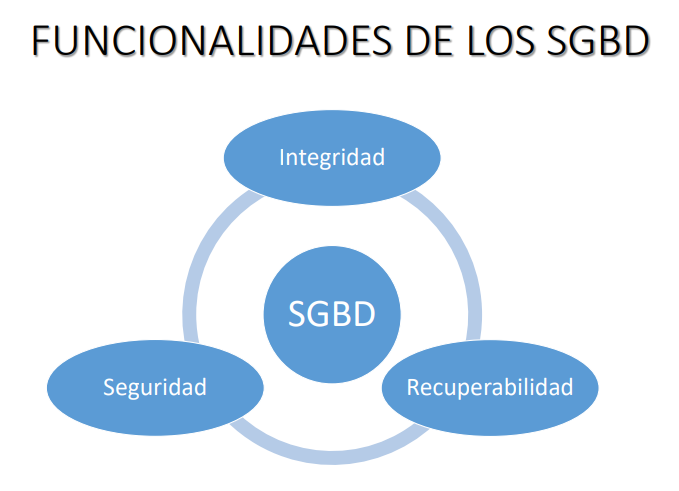

##### ¿Que es una base de datos?
Es una colección de datos que son tratados como una unidad

##### Funcionalidades de un SGBD

##### Pasos para la creación de una Base de Datos

Debemos de presionar *WIN + R* para abrir el terminal y escribir en el dbca para que se abra el asistente de configuración.

Siguiente > crear base de datos > procesamiento de transacciones >  

> NT: Me pide que elija que plantilla de base de datos voy a emplear, en este caso le damos a procesamiento de transacciones.

En el nombre SID colocamos nombre global sgbd.icsi y el otro sgbd se completa en el SID

Ahora en la siguente ventana son las opciones de gestión, es decir nos pregunta si quiere agregar el enterpreise manager, es una app web para conectarse a la BD para realizar las tareas administrativas.

Luego nos va a pedir las credenciales, orcle tiene 4 usuarios, principalmente tenemos al SYS el cual es el adm de la base de datos, este tiene el control total de la BD, y el system justamente es el administrador del sistema y existen otros para trabajar con enterprise manager.

Nos indica si queremos colocarlo a cada uno una contraseña distinta, pero queremos la misma para todas.

En la siguiente ventana nos pide los archivos de la base de datos, es decir lo que hace oracle es crear diferentes archivos de BD, podemos usar como indica la plantilla para establecer la ubicacion de los archivos. Lo dejaremos por defecto en sistemas de archivos y tal como aparece (ubicación de archivos de base de datos de plantilla) y nos creará la base de datos en una ubicacion denominada oradata, que es la ubicación por defecto.

En la siguiente ventana nos indica cual es el área de recuperación flash, el cual es un espacio que se encarga de guardar todo lo relacionado con la recupración de base de datos, como los backups.

En la siguiente ventana en donde nos aparece el contenido de la BD, oracle ya propociona algunos ejemplos de BD, es decir BD con contenido, entonces agregamos esos esquemas de ejemplos, como los cript, hr, etc.

En la siguiente ventana nos muestra los parametros de inicialización, al iniciar se establecce en base a ciertas variables, se da inicio a la memoria que procesos se van a trabajar, etc. Aqui lo definimos, pero por ahora lo dejamos por defecto.

En la siguiente nos indica como será el almacenamiento, que tipos de archivos se crearan y luego en la siguiente ventana nos dice seleccione las opciones de creación de base de datos.

Por ejemplo si quieremos guardar todos los pasos para usarlo en otro momento, le damos en generar archivos de comandos, y crea un script con las opciones que elejimos y también podemos guardarlo como una plantilla. 
luego le damos a terminar y nos muestra como será la BD y esperamos a que cargue.

##### Configuración del Listener

Ahora si vamos a inicio > programas > herramientas de migracion, aparece el  *net manager*, ahi encontraremos los listener, entonces ahí nos indica que esto se guardará en el archivo listener, hora.
Damos cick en listener y me muestra su ubicacion, el listener que hemos configurado, nos muestra el nombre del host

Vemos el puerto, pero esta en 1521, luego vamos a servicios de base de datos y vemos que no hay servicios, entonces agregamos la base de datos. Escribimos le nombre global de la BD, el sid y su directorio raiz y  
guardamos la configuración de red, con esto terminamos de configurar el Listener.

##### Configuración del nombre del Servicio

Eliminamos el que se acaba de agregar y agregamos uno nuevo.
Seleccionamos nomenclatura de servicios y lo agrego. Le asignamos un nombre, next y luego seleccionamos el protocolo. 

Colocamos el nombre de la base de datos sgbd.icsi y su tipo de conexion: servidor dedicado.
No le damos en probar, ahora vamos a iniciar los servicios y conectarnos a la base de datos.

> NT: Siempre cuando se crea la BD oracle crea un nombre del servicio. pero igual nosotros podemos modificarlo. Luego de haber hecho esto lo guardamos, guardar configuración de red.

##### Conexión a la Base de Datos

Presionamos *WIN + R* y escribimos CMD

Debemos de cambiar el nombre de la ventana del CMD, esto se hace escribiendo TITLE, ejem:

> TITLE Moreno Sanchez Neisser SGBD - 2020-02

Cambiar color de las letras a color verde

> COLOR A

Llamamos a SQLPLUS:

> SQLPLUS /NOLOG

Y ahora nos conectamos:

> connect sys/oracle@pro as sysdba

Nos conectamos como usuario SYS, para tener todos los privilegios y hacer modificaciones en la BD (administrador). 

*oracle* en este caso se llama mi base de datos y *@pro* es el nombre de mi listener.

Para ver el nombre de la Base de datos:

> select name from v$database;

