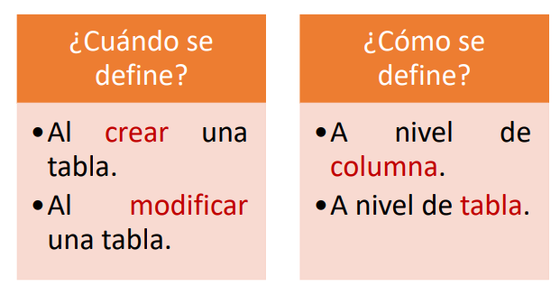
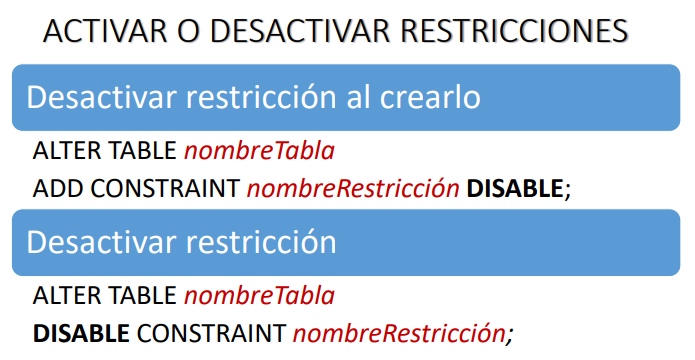
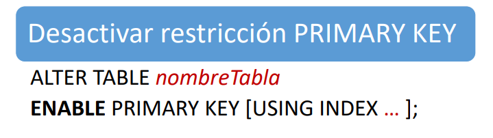
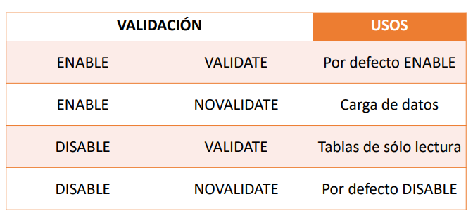

### RESTRICCIONES

Es una regla que buscaasegurar que los datos que se ingresa y se guarde sean correctos.

##### TIPOS DE RESTRICCIONES

Tenemos 5 tipos:

- NOT NULL
- CHECK (tiene que ver con condiciones)
- UNIQUE (valores únicos)
- PRIMARY KEY
- FOREIGN KEY

##### CARACTERÍSTICAS

Solo podemos definirlo cuando lo creamos o al modificarlo.

##### NOT NULL

Viene a ser un valor nulo, ¿Pero que lo define?
No es un vacío, porque muchas veces lo colocan espacio en blanco, pero ese espacio en blanco es un valor.

// Lo que aparece en corchetes es opcionalm entonces si indicamos null quiere decir que aceptamos nulos, si indicamos NOT Null pues no se acepta nulos.

- Definir restricción a nivel columna

> CONSTRAINT nombreRestriccion [NOT] NULL;

- Agregar o eliminar restricción

> ALTER TABLE nombreTabla
> MODIFY nombreColumna [NOT] NULL;

Todas las restricciones en un sistema gestor tienen nombres globales, osea no se pueden repetir en la base de datos. Si no indicamos un nombre a las restricciones pues el sistema le pone un nombre.

##### RESTRICCIÓN CHECK

- Definir restricción a nivel de tabla o columna.

> [CONSTRAINT nombreRestriccion]
> CHECK (<condicion>);

- Agregar restricción

> ALTER TABLE nombreTabla
> ADD CONSTRAINT nombreRestriccion CHECK (<condicion>);

Es importante que la restricción tenga un nombre adecuado

##### RESTRICCIÓN UNIQUE

Define valores únicosm y también acepta nulos.

- Definir restricción a nivel de columna

> [CONSTRAINT nombreRestriccion] UNIQUE;

- Definir restricción a nivel de tabla

> [CONSTRAINT nombreRestriccion]
> UNIQUE (<columna>, <columna>, ....);  // puede aceptar hasta 32 col

- Agregar restricción

> ALTER TABLE nombreTabla
> ADD CONSTRAINT nombreRestriccion
> UNIQUE (<columna>, <columna>,...);

##### RESTRICCIÓN PRIMARY KEY

La caracteristica de una clave primaria es que son únicas, pero unique tbn acepta valores unicos, ¿Entonces cual es la diferencia?
En una tabla puede haber varios campos candidatos a ser primary key, este identificador no se puede repetir y la diferencia es que no acepta nulos.

- Definir restricción a nivel columna

> [CONSTRAINT nombreRestriccion] PRIMARY KEY;

- Definir restricción a nivel de tabla

> [CONSTRAINT nombreRestriccion]
> PRIMARY KEY (<columna>, <columna>,...);

- Agregar restricción en tabla

> ALTER TABLE nombreTabla
> ADD CONSTRAINT nombreRestriccion
> PRIMARY KEY (<columna>, <columna>, ...)

Cuando la primary key tiene asociado varias columnas, entonces lo colocamos a nivel de tabla.

##### RESTRICCIÓN FOREIGN KEY

Es uan referencia, es decir como un puntero, es decir que en realidad en la tabla donde defino esa columna como clave foranea, en la tabla donde estoy refiriendo no está el valor, si no que definimos un puntero quen mos lleve  hacia la tabla donde si aparece el valor.  En la tabla donde definimos lo denominamos las tablas hijas y las tablas donde se encuentra se denomina tabla fado. 

Cuando creamos las FK siempre esa columna que definimos como clave foranea va a hacer referencia a una columna en la tabka padre que esté asociada a una clave primaria o clave unica, no necesariamente tiene que ser primaria.

Cuando lo creamos es necesario indicar de que manera se va a dar la eliminación.

- Definir restricción a nivel columna

> [CONSTRAINT nombreRestriccion]
> REFERENCES [<esquema>.] <nombreTabla>
> [(<columna>)]
> [ON DELETE {CASCADE | SET NULL}];

// Revisar, solo debe de haber una y no es necesario que vaya, solo que esa si esta columna que esta siendo referenciada y existe en la tabla padre se asocia con una clave primaria, si es así indicamos solo el nombre de la tabla y el sistema gestor ya sabe que hacemos referencia a ello.

También es necesario indicarle como se va a dar la eliminación
Cuando queremos eliminar, primero debe ser la tabla padre y luego la tabla hijo.

- Definir restricción a nivel de tabla

> [CONSTRAINT nombreRestriccion]
> FOREIGN KEY (<columna>, <columna>,....)
> REFERENCES [<esquema>.]<nombreTabla>
> [(<columna>, <columna>,....)]
> [ON DELETE {CASCADE | SET NULL}];

- Agregar Restriccion

> ALTER TABLE nombreTabla
> ADD CONSTRAINT nombreRestriccion
> FOREIGN KEY (<columna>, <columna,...>)
> REFERENCES [<esquema>.] <nombreTabla>
> [(<columna>, <columna>,...)];

##### VISTAS DEL DICCIONARIO DE DATOS PARA RESTRICCIONES

- DBA_CONSTRAINTS
- DBA_CONS_COLUMNS

##### ADMINISTRANDO RESTRICCIONES

Aqui es activar, en lugar de desactivar.

##### RESTRICCIONES VALIDADAS

Consiste en verificar una restriccion
Esto es cuando se carga los datos hay que verificarlos

##### RESTRICCIONES DIFERIDAS

