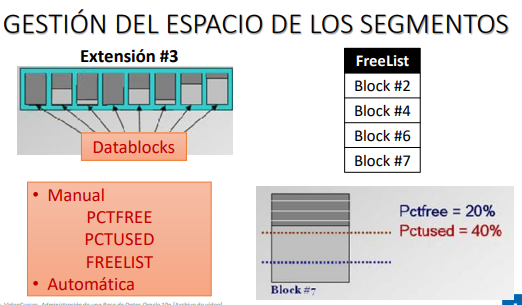

### ¿QUÉ ES UN TABLESPACE?

Es una estructura lógica, porque no existe como tal, fisicamente los tablespace no existe, lo que si vemos en la base de datos claramente son las datafiles, porque si aparecen en una cierta parte del disco.

Entonces los tablespace vienen a ser el espacio donde guardamos los datafiles, y en un tablespace podemos encontrar un data faile o mas.
Los objetos se guardan en los datafiles, entonces cuando nosotros creamos un objeto siempre indicamos donde lo guardamos en terminos de tablespace.

En la imagen se ve que en el lado izquierdo hay un esquema, y ahi tendremos diferentes (tablas), y esas tablas podemos indicar en que tablespace podemos guardarlo.

Entonces en una base de datos podemos tener varios tablespace y estos pueden pertenecer a una cierta base de datos logica o pueden estar en un solo disco, etc.

### VENTAJAS DE LOS TABLESPACE:

- Separa los datos del usuario de los del diccionario: Es adecuado tener por un lado los datos del sistema y por otro los datos propios de una base de datos. ¿Cual es el tablespace del usuario Sys o cual le pertenece?, es el system, entonces aquí se guardaran los datos del diccionario (diccionario de datos).

- Separa los datos de distintas aplicaciones: osea podemos tener varias bd logicas y cada una de ellas pueden corresponder a una aplicación, entonces nosotros podemos indicar que cierta BD logica se guarde en cierto tablespace, entonces de esa manera separo datos de diversas aplicaciones.

- Distribuye la información en diferentes discos: asi como puedo indicar que cierta base de datos se guarde en un tablespace, también puedo indicar que cierto tablespace se guarde en cierto disco, ejem: tengo un disco A para cierto tablespace, un B para otro.

- Distribuye la información según su uso: Puedo elegir que los objetos se guarden en cierto tablespace.

- Permite poner una porción de la base de datos en modo offline:
Cuando queremos que solo una parte de la base de datos este disponible (en modo offline), osea no es necesario tenerlo todo, si no solamento el tablespace donde este la información a la cual le voy a realizar una atrea administrativa. Sabemos tbn que cuando la bd esta en modo offline los usuarios no se pueden conectar. 

- Permite realizar copias de seguridad de una porción de la base de datos: Esta relacionada con la anterior, porque de esa porcion de la BD podemos realizar copias de seguridad. 

### GESTIÓN DE LOS TABLESPACE

En la base de datos tenemos los objetos (desde el punto de vista logica) tienen un cierto nombre, fisicamente se guardan de la siguiente manera, a esos objetos les pertence cierto segmento. Además en ese segmento se va a divir porque tenemos extensiones (las tratamos por números) y por otro lado en cada extension se almacena bloques de datos (aqui aparece nuestros registros), entonces esta es la estructura.

Existen dos tipos de gestión:

- Gestionados por el diccionario

- Gestionados localmente

En un inicio se guardaba en el diccionario, inclusive el tablespace system se gestionaba ahi, entonces el acceso era lento porque imaginate buscar toda la informacion en el diccionario. Pero ya apartir de la versión 10 de oracle, nos permite gestionar de manera local. De tal manera que yo necesito recuperar informacion de la tabla empleado, entonces necesito identificar en que tablespace se encuentra almacenado. 

Ahora la manera de gestionar las extensiones es de forma local.

### GESTIÓN DEL ESPACIO DE LOS SEGMENTOS

Por ejemplo la extension #3 tiene ciertos bloques de datos y en uno de ellos es donde guardamos datos. Imaginemos que hablamos del bloque #7, el sistema gestor maneja un FreeList que se denomina lista de bloques vacios. Cada bloque maneja dos tipos de parametros: Pctfree y Pctused.

La forma de gestionar los segmentos es de manual o automatica, en manual definimos los porcentajes y de cierta manera hasta cierto punto la FreeList, entonces es tedioso, lo mas adecuado es la gestión automatica. 

### TAREAS DE GESTIÓN DE TABLESPACE PERMANENTES

Lo dominamos permanente por el motivo de que lo que guardemos se mantenga en el tiempo. 

- Visualizar tablespace por defecto de los usuarios:

> SELECT USERNAME, DEFAULT_TABLESPACE FROM DBA_USERS;

Cuando nosotros creamos una base de datos, y dentro de ella un usuario, a ese usuario se le asigna un tablespace por defecto, actualmente la que se emplea o aparece en la bd cuando lo creamos desde el punto de vista fisico, el tablespace donde se guarda la data es el USERS.

Cuando nosotros creamos un usuario y no indicamos en que tablespace se va a guardar, entonces se guardará en el tablespace que aparece por defecto para este usuario. Ya sabemos que podemos indicar un WHERE y hacer una consulta mas especifica, en la condición ponemos en comillas simples y mayusculas, porque el sistema lo guarda en mayusculas los nombres de los objetos, y en minusculas guarda el nombre de los parametros.

- Visualizar información de segmentos:

> SELECT SEGMENT_NAME, TABLESPACE_NAME, BYTES FROM DBA_SEGMENTS;

// segment los atributos, tablespace el nombre y bytes es la cantidad de bytes que indique y que estan ocupados.

- Visualizar información de extensiones:

> SELECT SEGMENT_NAME, EXTEND_ID, BYTES FROM DBA_EXTENTS;

Podemos visualizar informacion de las extensiones y no olvides que es por numeros, entonces consultamos el nombre del segmento, el id (numero del segmentos) y los bytes.

### TAREAS DE GESTION DE TABLESPACE PERMANENTES:

- Crear tablespace permanente:

> CREATE TABLESPACE nombreTbPermanente DATAFILE 'nombreDataFile' SIZE tamInicialDataFile EXTENT MANAGEMENT LOCAL UNIFORM SIZE tamaño

Lo de minuscula es lo que cambia, el nombre de la tablespace permanente, el datafile (siempre cuando se crea un tablespace como minimo debe de aparecer un datafile) viene a ser la ruta y su extension es .dbf, el Size corresponde al tamaño inicial ejem 1M, y el ultimo nos tiene cual será la gestion de las extensiones, es decir cuando necesite mas espacio este daatfile le indicamos q va a crecer con extensiones de tamaño uniforme y con el tamaño que indiquemos, pero este tamaño debe de ser menor al que le indicamos en su creación. Por otro lado solo podemos colocarlos auto o normal, si no lo colocamos lo tomara por defecto automatico.

Cuando creemos el tablespace space lo adecuado es colocarlo con todo este código, asignarle su tamaño y todo, pero también podemos crear solo con el nombre y el datafile y los demas parametros se consideraria por defecto. 

### TABLESPACES TEMPORALES

Quiere decir que la información que logremos almacenar va a durar lo que dura una transacción o cuando el usuario solo este conectado. Osea si se desconecta se elimina o si termina la transaccion se elimina tambien.

Se usan por el motivo de que porque necesito realizar operaciones de ordenación. Ya en realidad hay un espacio para realizar estas operaciones que esta definido por el parametro SORT_AREA_SIZE (alli indicamos cual es el tamaño de esta área que esta reservada para realizar esta operación). ¿Pero que sucede cuando se llena?
Es necesario tener otra area en la cual podamos almacenar. 

Que instrucciones o peraciones nos puede llevar a ordenar datos, son las sgts:

> CREATE INDEX, SELECT DISTINCT, ORDER BY, GROUP BY, .....

tambien cuando realizamos combiancion de tablas, necesitamos un espacio auxiliar.

Entonces, ¿Qué guarda estas tablespace temporales?

guarda objetos temporales, como las tablas temporales.

### TAREAS DE GESTIÓN DE TABLESPACE TEMPORALES

- Visualizar tablespace temporal definido para cada usuario:

> SELECT USERNAME, TEMPORARY_TABLESPACE FROM DBA_USERS;

Nosotros podemos personalizar para indicar que cada usuario tenga su propio tablespace temporal. La consulta lo hacemos a la vista users.

- Visualizar los tempfiles de los tablespaces temporales:

> SELECT FILE_NAME, TABLESPACE_NAME FROM DBA_USERS;

Tempfiles: asi como los tablespace permanente tiene su datafile, el tablespace temporal tiene tbn su archivo que se denomina tempfiles. Pero esto no quiere decir que se borra si el usuario se desconecta, esto permanece en el disco.

- Crear tablespace temporal

> CREATE TEMPORARY TABLESPACE nombreTBTemporal TEMPFILE 'nombreTempFile'
> SIZE tamTempFile EXTENT MANAGEMENT LOCAL UNIFORM SIZE tamaño;

- Agregar un tempfile:

> ALTER TABLESPACE nombreTBTemporal ADD TEMPFILE 'nombreTemFile' SIZE tamTempFile;

### DISPONIBILIDAD DE LOS TABLESPACE

Osea podemos colocar un tablespace que este en en modo online y los usuarios puedan consultarlo o de modo offline, osea que no esté disponible. 

Cuando decimos que un tablespace este en modo offline, ¿Como llevamos a ese estado?

Puede ser:

Esto tiene que ver con la manera de como cerrar los datafiles que pertenece a ese tablespace que queremos colocarlo de manera offline.

- NORMAL: quiere decir que simplemente que todos los datafiles que pertenecen a ese tablespace que quiero enviar al modo offline, lo cierro de forma correcta.

- TEMPORARY: puede ser que un datafile por un motivo no lo pueda cerrar.
Lo que hace el sistema es cerrar los datafiles de manera normal y la que no peude cerrarlo lo obliga, lo hace de forma bruta de tal manera que luego hacemos operaciones de forma de recuperación sobre el datafile.

- IMMEDIATE: Cierra todos los datafiles, lo cierra de manera bruta y que luego tenemos que hacer la recuperación.

### DISPONIBILIDAD DE LOS TABLESPACE

- Poner un tablespace en modo OffLine:

> ALTER TABLESPACE nombreTBPermanente OFFLINE NORMAL; // si no colocamos el nomal lo hace por defecto.

> ALTER TABLESPACE nombreTBPermanente OFFLINE;

- Poner un tablespace en modo ONLINE:

> ALTER TABLESPACE nombreTBPermanente ONLINE;

- READ ONLY - READ WRITE:

• Evitar escrituras en los datafiles (incoherente)
• Proteher información historica
• Evitar la necesidad de backups continuos

Los datafles también podemos llevarlos a estos modo, por defecto cuando abrimos la base de datos y le damos alter database open (se abre los datafiles) ESTA EN MODO LECTURA Y ESCRITURA.

- Poner un tablespace en modo solo lectura: 

 > ALTER TABLESPACE nombreTBPermanente READ ONLY

- Poner un tablespace en modo lectura - escritura:

> ALTER TABLESPACE nombreTBPermanente READ WRITE;

- Renombrar un tablespace:
> ALTER TABLESPACE nombreAntiguotablespace RENAME TO nombreNuevoTableSpace;

¿Puedo cambiar todos los nombres? no!

Los que pertenece a los usuarios sys? osea el system no se puede cambiar.
Cuando se realiza esta cambio tambien se escribe en los archivos de control, en los redos estan los cambios con respecto a la data.

- Eliminar un tablespace:

> DROP TABLESPACE nombreTablespace;
//esto siempre y cuando el tablespace no tenga datafiles, es casi imposible.

> DROP TABLESPACE nombreTablespace INCLUDING CONTENTS;
//en este caso se elimina el tablespace y los datafiles de forma logica, no de fisicamente.

> DROP TABLESPACE nombreTablespace INCLUDING COTENTS AND DATAFILES;
// Aquí si se elimina logicamente y fisicamente.
// Practicaremos con esta ultima opción

### ADMINISTRACION DE DATAFILES

DBA_DATA_FILES: Estos archivos de datos para realizar las consultas simplemente lo hacemos con esto.

- File number: va a tener dos numeros

• Absoluto:es justamente con respecto a toda la bd

• Relativo: respecto a su propio tablespace

- Número de Datafiles:
Nos define el nuemro de datafiles q puede tener una bd
 
### UBICACION DE LOS DATAFILES

¿Por qué debemos de ubicarlos en diferentes lugares?

La estructuracion debe de hacerse de forma aecuada para optimizar y sobre todo el acceso general a la información.

Si yo tengo 4  discos por ejemplo, como en la imagen, en un disco colocamos los datafiles de baja actividad con la de alta actividad, porque de cierta manera cuando demos el acceso de los usuarios a ese fisco no lo voy a saturar. Entonces asi buscamos el equilibrio.

TAREAS DE GESTIÓN DE DATAFILES:

- AGREGAR DATAFILE A UN TABLESPACE:

> ALTER TABLESPACE nombreTBPermanente ADD DATAFILE 'nombreDatafile' SIZE tamInicialDatafile AUTOEXTEND ON NEXT tamCrecimiento MAXSIZE tamMax;

Para qye cresca ek dafile autoextendiendo ese tamaño que le indicamos hasta llegar al tamaño maximo.

- Redimensionar un datafile:

> ALTER DATABASE DATAFILE 'nombreDatafile' RESIZE tamNuevo;

// Darle un tamaño nuevo. 

- RENOMBRAR EL ARCHIVO DATAFILE (INFORMAR AL CONTROL FILE)

> ALTER TABLESPACE nombreAntiguodatefile RENAME DATAFILE nombreNuevodatafile;
// aqui falta el nombre del tablespace

Para renombrar o reubicar que es lo mismo:

- ELIMINAR UN DATAFILE:

> ALTER TABLESPACE
> DROP DATAFILE 'nombreDatafile'

Hay que tener en cuenta que no podemos eliminar todos los data files, 
Para eliminar primero debe de estar abierto el datafile y también se considera que no debe de tener datos. Cuando queremos eliminar un datafile por lo general no debe de ser el unico que pertenezca o tenga porque no nos va a dejar.

- REUBICAR O RENOMBRAR UN DATAFILE:

1.- Poner tablespace, que lo contiene en modo offline
// para que no este disponible

2.- Reubicar o renombrar el archivo en el sistema operativo
// hacerlo con full copy o otros.
// entortno grafico tambien

3.- Renombrar el archivo

4.- Poner el tablespace en modo online

- Redimensionar un datafile

> ALTER DATABASE DATAFILE 'nombreDatafile' RESIZE tamNuevo;

