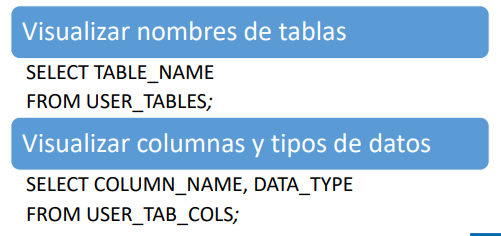

- Información usada para deshacer los cambios en la base de datos, pero en la data, y si existiera cambios en la estructura de la bd se guarda en los archivos de control. También se podría decir deshacer las transacciones que no han sido transformadas.

- Copia de datos originales, nosotros sabemos que los datos se encuentran en los datafiles, fisicamente ahí y es necesario hacer una copia cada vez que se lee estos archivos.

- Capturado por cada transacción que cambia datos

Los tablespace soporta estas operaciones:

 - Las operaciones Rollback nos permite deshacer
 - Consistencia de Lectura
 - Recuperación de transacciones fallidas

 ### TRANSACCIONES Y DATOS UNDO

 Cada vez que realizemos alguna operación que puede ser actualización o transacción de ciertos regitros, en este ejemplo se ve que realizemos algunso cambios, ese cambio es ese pequeño bloque imagen nuevo, sin embargo la imagen nueva se va a guardar en el segmento Undo.

Si la transacción no la finaliza correctamente no debería aparecer que ese asiento a sido ocupado, a esto se denomina consistencia en la lecttura.

### TAREAS DE GESTIÓN DE TABLESPACE UNDO

Visualizar el nombre del tablespace UNDO de la base de datos:

> SHOW PARAMETER UNDO_TABLESPACE  // Con esto podemos saber el tablespace que emplea la base de datos, siempre lo va a tener.

Visualizar tipo de gestión de tablespace UNDO (Manual/Automática):

> SHOW PARAMETER UNDO_MANAGEMENT  // lo adecuado es que sea automático

Modificar tablespace UNDO de base de datos:

> ALTER SYSTEM SET UNDO_TABLESPACE=nombreTBUndo;

Nosotros podemos crear un tablespace de tipo undo y que la bd lo utilice para que realice esas operaciones. 

Creamos el tablespace logicamente y luego le damos ALTER SYSTEM SET UNDO_TABLESPACE=nombreTBUndo; y cambiamos el tablespace de tipo undo que es usado por la BD. Toda BD tiene al menos un tablespace de tipo ando y ese se define para toda la base de datos.

### RETENCIÓN PARA UNDO

- UNDO_RETENTION

Al consultar este parametro UNDO_RETENTION y con esto nos indica el tiempo de retención que está justamente la información antigua se esta guardando en este tablespace.

- CLÁUSULA RETENTION GUARANTEE 

Puede que cuando creemos el tablespace no aseguren la retención, porque cuando creamos el tablespace al final debemos indicar la cláusula RETENTION GUARANTEE y con eso le decimos que aseguramos que esos datos se encuentren por cierto tiempo en el tablespace.

### TAREAS DE GESTIÓN DE TABLESPACE UNDO

- CREAR TABLESPACE UNDO:

> CREATE UNDO TABLESPACE nombreTBUndo
> DATAFILE 'nombreDataFile' SIZE tamDataFile
> AUTOEXTEND ON NEXT tamCrecimiento MAXSIZE tamMax
[RETENTION NOGUARANTEE | RETENTION GUARANTEE];  

También se puede indicar un tamaño máximo limitado hasta agotar el disco (Buscar el comando), aunque no es recomendable.

Al final colocamos la última cláusula, para garantizar o no la retención (hablamos de lo que está en corchetes).

- AGREGAR DATAFILE A TABLESPACE UNDO:

> ALTER TABLESPACE nombreTBUndo
> ADD DATAFILE 'nombreDataFile' SIZE tamDataFile
> AUTOEXTEND ON NEXT tamCrecimiento MAXSIZE tamMax;

### TABLAS

- TABLAS ORDINARIAS:

Las tablas que por lo general creamos vienen a ser las tablas ordinarias.
Se guardan en los tablespace permanentes.

- TABLAS CTAS:

Estas son aquellas que en el momento en el que indicamos la intrucción, no solamente crea la estructura (tabla), si no que también guarda la carga de datos.

Está es una tablas se crean apartir de una consulta que puede ser a otras tablas

- TABLAS TEMPORALES:

Son justamente las que se guardan en los tablespace temporales.
La caracteristica de las tablas temporales el tiempo que la data se va a encontrar ahí es lo que dura por lo general una transacción o el tiemp oque el usuario está conectado, pasado el tiempo se elimina la data de estas tablas temporales. Entonces necesariamente una tabla temporal va a ser creada en un tablespace temporal.

### ENCRIPTAR COLUMNAS

Oracle nos permite encriptar columnas. La caracteristica de la encriptación es para que no sean visibles, por ejemplo las contraseñas. 

Los pasos para encroptar una columna:

1.- Activar la cartera 
    Crear carpeta WALLET en ADMIN\BaseDatos

2.- Agregar Clave de incriptación:
>   ALTER SYSTEM SET ENCRYPTION KEY
>   IDENTIFIED BY "contraseña";

3.- Crear tabla con columna encriptada

> CREATE TABLE nombreTabla
> (nombreColumna tipoDato(longitud),
>  .....
> nombreColumna tipoDato(longitud)ENCRYPT,
> )TABLESPACE nombreTablespace;

Si nos va permitir escriptar siempre y cuando hayamos hecho los pasos anteriores.

### TABLAS CTAS

Estas tablas se crea y se carga de datos y esta tabla viene de una cierta consulta. Es necesario indicarle cierta caracteristicas para que acelere de una u otra forma la creación, ejem para realizar la creación y queremos aumentar el rendimiento, podemos indicar que varios procesos para que trabajen en conjunto de forma paralela para que realizen la creación de la tabla, ahí usamos la palabra Parallel.

- Paralelizar la creación:
    
    • PARALLEL

- Obviar los redo:

    • NOLOGGING

Dado cuando se crea esta tabla se le tiene que insertar datos, en las insercciones existen las redos endry, por tal insercción tendremos un redo endry para obviar estos redos, y no se genere esta información (redo entry) empleamos la palabras reservada Nologging para evitar que se genere estos redo entry y se tengan que guardar en los redos.

Importante: Siempre cuando empliemos el Nologging antes de crear una tabla debemos de crear un backup de la data.

- Compresión de tabla:

    • COMPRESS

Esto sirve para comprimir la tabla, comprimimos el contenido. Si la tabla es de solo lectura entonces podemos emplear este termino.

### TAREAS DE GESTIÓN DE TABLA CTA

- Crear Tabla CTAS:

> CREATE TABLE nombreTabla
> PARALLEL | COMPRESS | NOLOGGING
> AS
> consultaSQL;

// Cualquiera de esas tres opciones y le indicamos la consulta SQL
apartir del cual se va a crear la estructura de la tabla y ademas los datos que se van agregar.

### VISTAS DEL DICCIONARIO DE DATOS PARA TABLAS

> DBA_TABLES 
//Para poder consultar el nombre de las tablas que tenemos en la base de datos, posiblemente lo hacemos con esta primera vista.

> DBA_TAB_COLS
// si queremos consultar las columnas de las tablas lo hacemos mediante esta instrucción.

### TAREAS DE GESTIÓN DE TABLAS

- Visualizar nombres de Tablas:

> SELECT TABLE_NAME FROM USER_TABLES; 
// Para saber a las tablas que le pertenece a un usuario.
// User solo visualizamos solo los que nos pertenece
// con dba solo los que tiene categoria de adm de bd

- Visualizar columnas y tipos de datos:

> SELECT COLUMN_NAME, DATA_TYPE FROM USER_TAB_COLS;
// con esto también consultamos y ver que otros datos mas hay.

### TABLAS TEMPORALES

Estas tablas nos permiten guardar configuración de manera temporal y se crea de un tablespace temporal de un usuario. 

- Creado en el tablespace temporal del usuario

- > CREATE GLOBAL TEMPORARY TABLE nombreTabla

Cuando decimos que es global, en oracle (hasta la versión 18) no aparece tablas privadas, no hay. La única manera es trabajar con tablas de forma global.

- > ON COMMIT DELETE / PRESERVE ROWS

Cuando creamos esta tabla podemos emplear estas palabras, esto quiere decir que en la primera si queremos que la informacion de estas tablas se encuentre allí hasta que dure la transacción lo indicamos con ON COMMIT DELETE, esto quiere decir que las filas se van a eliminar con un Commit.

Si queremos que el contenido se mantenga hasta que el momento usuario se desconecte se emplea el ON COMMIT PRESERVE ROWS
Que quiere decir que las filas se van a mantener con el commit.

> CREATE GLOBAL TEMPORARY TABLE nombreTabla
> (nombreColumna tipoDato(longitud),
> ) ON COMMIT DELETE/PRESERVE ROWS;

### TAREAS DE GESTIÓN

- Modificar tablas existentes:

> ALTER TABLE nombreTabla
> MODIFY nombreColumna tipoDato (longitud);

// modificar uno por uno, y también podemos agregar una restricción

- Añadir Columna:

> ALTER TABLE nombreTabla
> ADD nombreColumna tipoDato (longitud);

- Renombrar columna:

> ALTER TABLE nombreTabla
> RENAME COLUMN nombreAntiguo TO nombreNuevo;

- Eliminar columnas:

> ALTER TABLE nombreTabla
> DROP COLUMN nombreColumna;

- Dejar columna como inactiva:

> ALTER TABLE nombreTabla
> SET UNUSED (nombreColumna);

- Cambiar de tablespace:

> ALTER TABLE nombreTabla
> MOVE TABLESPACE nombreTablespace;

Por otro lado también si queremos que la tabla de tipo ctas volver a usarla, muchas veces es necesario descomprimir la tabla (comprimido solo se puede leer).

### INDICES

Es importante trabajar con indices porque es mas fácil hacer la busqueda de los datos. Los indices van acelerr la busqueda, pero no quiere decir que hacer un indice sea lo mas adecuado porque conlleva con carga administrativa. Cuando creamos uno por lo general se crea la estructura de tipo arbol.

Es recomendable crear indice cuando en una tabla vamos a guardar por lo menos 50 mil registros.
El sistema gestor por defecto si crea indices.

### LOS INDICES B-TREE

En el indice almacenamos el ROWID o el dato.

### INDICE IMPLICITOS

Es decir estos son indices que se crea por la aparición de ciertas estructuras o restricciones.

- constraint PRIMARY KEY
// cuando lo agregamos la clave primaria solo se hace una vez, para ello creamos un indice para manejar todas las claves primarias 

- constraint UNIQUE 
// Son valores unicos, no se puede repetir, el gestor crea un indice para manejar esto.

Oracle le da nombres aletorios que cra por defecto, por lo general es SYS t le agrega unos numeros.

### TAREAS DE GESTIÓN DE INDICES

- Crear indice:

> CREATE INDEX nombreindice
> ON nombreTabla (campoIndexacion)
 // puede ser uno  varios campos (sugiere maximo 2 campos)

> TABLESPACE nombreTablespace;
// podemos indicar en que tablespace guardarlo
// este es para crear un indice tipo arbol

- Visualizar nombre de Indices:

> SELECT INDEX_NAME, TABLE_NAME FROM USER_INDEXES;

Queremos agregar una restricción de clave primaria pero no queremos que el sistema agregue el nombre del indice de acuerdo a como esta programado, si no queremos personalizar ese nombre.

- Agregar nombre a indice implicito primary Key:

> CREATE TABLE nombreTabla
> (nombreColumnaPrimaryKey tipoDato PRIMARY KEY
> USING INDEX
> CREATE INDEX nombreIndice ON nombreTabla
> (nombreColumnaPrimaryKey)), 
>  ...);

// Minuto 56 del video

- Crear indice Unique:

> CREATE UNIQUE INDEX nombreIndice
> ON nombreTabla (columnasUnique);

// tiene asociado la restricción de tipo Unique. Quiere decir que la columna que definimos como campO de busqueda no se debe de repetir, los valores deben de ser únicos.
 
### INDICES EXPLICITOS

- INDEX
- BITMAP:
- Basados en función

### TAREAS DE GESTIÓN DE INDICES

- Crear indice Bitmap:

> CREATE BITMAP  INDEX nombreIndice
> ON nombreTabla (columnaIndexacion);

- Crear indice Basado en función:

> CREATE INDEX nombreIndice
> ON nombreTabla (funcion);

- Reconstruir Indice:

> ALTER INDEX nombreIndice REBUILD;
// lo reconstruimos en otro espacio, no en el mismo donde fue creado.

- Reestructurar Indice:

> ALTER INDEX nombreIndice COALESCE;
// Lo restructuramos en el mismo espacio

- Eliminar Indice:

> DROP INDEX nombreIndice;

